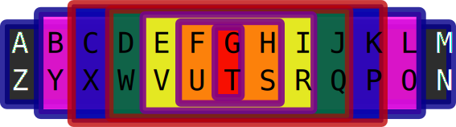

# Thirteen Thirteens

The 13 13s is part of the augmented reality game Yggdrasil. There are 13 axes each with 13 elements. There are 13 teams, each of which is mapped to one element on each axis.

The most important axis is the essential need. 

## The 13s

### 13 Needs
  * Security
  * Surveillance
  * Communications
  * Substances
  * Food/Water
  * Sex
  * Shelter
  * Tools
  * Transport
  * Housekeeping
  * Time/Record Keeping
  * Transparency
  * Community/Therapy

The concept here is to come up with a 13-way partition that covers everything people want and covers all the services necessary to organize a game.

Yggdrasil is fundamentally about control of space. Spaces are deliniated by 3D maps and preferential token weighting alternates between the alliances. For one round red teams' tokens are worth double, then purple, then blue, then purple, red, repeat.

Because purple is in the queue twice and has a fifth team to red and blue's four, it is strongly preferenced to have access to space.

This is because two of the teams – sex and substances – are illicit. Some of what they provide will be illegal. The ultimate goal is have the establishment actively participating as one of the 13 teams: gold. Until that happens, there is an adversarial relationship that is handled by having contingency plans based frequently around amassing large groups of people to impede the movement of vehicles.

So the gold team exists to identify members of the establishment. All law-enforcement officers should hold gold to signal their allegance to that organization.

Gold would be minted, like Black, from an attestation system where an officer submits a video claiming to be law-enforcement & the approval of others equates to a token transfer.

The 13 teams tokens are minted to represent different things. Black tokens are meant to go to black lives. They will be used to gate access to information useful in building a distribution network for substances to act as a violence-free alternative to the cartels.

### 13 Teams
  * A–Z
  * B–Y
  * C–X
  * D–W
  * E–V
  * F–U
  * G–T
  * H–S
  * I–R
  * J–Q
  * K–P
  * L–O
  * M–N

### 13 Months
  * ♑
  * ♒
  * ♓
  * ♈
  * ♉
  * ♊
  * ♋
  * ♌
  * ♍
  * ♎
  * ♏
  * ⛎
  * ♐

The 13-sign zodiac is the scientifically accurate representation of the position of the constelations relative to the plane of the elliptic.

Coincidentally, the 0ᵗʰ day of Capricorn (the calendar is zero-indexed with 100 minute hours and hundred second minutes) falls on January 20ᵗʰ, the Inauguration of the President of the U.S.A..

The 0ᵗʰ year then is taken to be the start of the Revolution. It can either be Joe Biden if he facilitates the formation of a Caliphate and and end to war, or it can be his successor.

Personally, I am counting this year a pessimistic -3 with four remaining to Biden's successor and real change.

Were Biden to manage to pull off being President of Zero, he would naturally serve two terms leaving on 7/♑︎/0.

### 13 Names
  * William James Holcomb
  * lliWill
  * dysbulic
  * δυς
  * ΔΥΣ
  * 759-33-5314
  * dys
  * Loy'l
  * Jobs
  * Hammy
  * Jacob
  * Geryon
  * Will

Players have team-specific noms de jeux. How someone identifies you will potentially carry additional overtures based on its associations.

Your Gold or "government name" is your social security number.

### 13 Projects
  * **Stay:** Mapping spaces, capturing task descriptions, and coordinating property management, allowing participants to maintain and reserve spaces at a minimum of monetary cost.
  Space is rented by a user under the auspices of a set of teams. The team specifies the expected application of the space.
  * **Substances:** An interface for selling things with a digital testing certificate. Aimed in large part at the violence, dilution, & theft-free distribution of substances, be they pharmacetical or psychotropic.
  * **Courier:** Rather than most substances being delivered through the mail, there could be a person-to-person blind delivery service. Couriers are pairs of people in a vehicle. They serve a variety of tasks dependant on the need:
  This includes:
    * **Dashcam:** An Android app for recording driving with an active operator to be called in times of emergency. The same application is used when a pair is called on as camerapeople. One of the main rule enforcement mechanisms is to send camerapeople to investigate disturbances.

    The streams are shared with anyone present in them.
    * **Dispatch:**  Cars are generally two people and they can serve a variety of functions. As Driver & [Courier](#courier) delivering a parcel. As Driver and [Clerk](#stuff) pandering to a rider in the car. The dispatch application helps the pairs coordinate.
  * **Alignments:** Allow the 13 teams of Yggdrasil to coordinate with each other to allocate the 13 axes. Each teams starts by specifying their optimal layout. This program would also contain other aspects of team ccordination such as the various bonding curves for token swapping.
  * **Code:** The 13 teams each spearhead a project. Participants may be members of multiple teams to varying extents. Each team has a development group for each of the 13 projects. (Albeit perhaps of size zero.) These dev groups meet in spaces coordinated by [Stay](#stay). [Code](#code) captures livestreamed pair programming sessions encoded with metadata describing tasks, decisions, and bugs. Peers review the process and give kudos and demerits.
  * **Mïmis:** A stream of JSON-LD documents alter the state of a Neo4j graph. Users navigate the resultant structure.
  * **Reader:** A web-based eReader meant to allow browsing the universal library stored in [Mïmis](#mïmis).
  * **Stuff:** What does the world hold and where is it located.
  * **When:** 13-Sign Zodiac / Hijri / 5hr + 5hr light & dark / 100 minutes per hour / 100 seconds per minute; coordinated with the housing arrangements from [Stay](#stay) & devs from [Code](#code).
  * **Ring:** Part of rules enforcement relies on the credible threat of physical force. This is determined by peer-reviewed recordings of fights.

### 13 Colors
  * Green #009900
  * Blaze #9D3E3F
  * Brown #663300
  * Black #000000
  * White #FFFFFF
  * Cyan #00FFFF
  * Yellow #FFFF00
  * Gold #FFDF00
  * Silver #C0C0C0
  * Copper #B87333
  * Pink #FF007F
  * Peach #FFE5B4
  * Gray #808080

### 13 Languages
  * English
  * Chinese
  * French
  * Wolof
  * Arabic
  * Esperanto
  * Swedish
  * Spanish
  * Hindi
  * Russian
  * Hopi
  * Sign Language
  * ¿Category Theory?

### 13 “Realms”
  * ᛗ
  * ᚫ
  * ᚡ
  * ᚦ
  * ᛃ
  * ᛏ
  * ᛠ
  * ᛁ
  * ᛊ
  * 🐲
  * 🐿
  * 🦌
  * 🦅

### 13 Animals
  * Eagle
  * Squirrel
  * Deer
  * Dragon
  * Bear
  * Horse
  * Whale
  * Fish
  * Ant
  * Cat
  * Dog
  * Platypus
  * Giraffe

### [13 Spaces](http://gaians.web.app)

### 13 Times
  * Gregorian Calendar
  * Hijri
  * 13-Sign Zodiac (forward counting)
  * 13-Sign Zodiac (countdown counting)
  * 24-Hour Day
  * 20-Hour Day
  * International Fixed Calendar
  * 5 Hours of Light & 5 of Dark; 100 minute hours & 100 second minutes
  * Mayan Long Count *(13.0.0.0.0 = 2012/12/21, maxes 20.20.20.18.20)*
  * 
  * ⋮

### 13 Guilds
  * Gardeners'
  * Gatherers'
  * Hunters'
  * Rangers'
  * Protectors'
  * Couriers'
  * Writers'
  * Builders'
  * Thinkers'
  * Guides'
  * Orphans'
  * Commercants'
  * Sharpshooters'

### 13 Heads
  * δυς
  * Joe Biden *(President of the U.S.A.)*
  * Timothy L. Nuvangyaoma *(Chairman of the Hopi Tribal Council)*
  * António Guterres *(Secretary General of the U.N.)*
  * _Celebrity #1_:
  * _Celebrity #2_:
  * _Celebrity #3_:
  * Alvaro Tukano *(cacique, Chief of the Tukano Tribe)*
  * ⋮
   
### 13 Signals
  * Names
  * Dates
  * Colors
  * Passport
  * ⋮

## Mappings

### “The Establishment”
  * _Realm_: **🦅**: **Veðrfölnir**: The hawk sitting on an eagle in the branches of Yggdrasil
  * _Color_: **Gold**
  * _Language_: **English**
  * _Name_: **759-33-5314**
  * _Team_: **B–Y if Biden participates; F-U otherwise**
  * _Time_: **Gregorian Calendar**
  * _Month_: **♈**
  * _Signal_: **Passport**
  * _Head_: **The President of the U.S.A.**
  * _Need_: **Surveillance**
  * _Animal_: **Eagle**
  * _Project_: **Courier**
  * _Guild_: **Sharpshooters**
  
### “The World”
  * _Realm_: **ᛗ**: **Midgard**: The realm of Yggdrasil inhabited by humans
  * _Color_: ****
  * _Language_: ****
  * _Name_: ****
  * _Team_: ****
  * _Time_: ****
  * _Month_: ****
  * _Signal_: ****
  * _Head_: **Secretary General of the UN**
  * _Need_: ****
  * _Animal_: ****
  * _Project_: ****
  * _Guild_: ****
  
### “The Resistance”
  * _Realm_: **ᛃ**: **Svartálfar**: The realm of Yggdrasil inhabited by elves
  * _Color_: ****
  * _Language_: ****
  * _Name_: ****
  * _Team_: ****
  * _Time_: **13-Sign Zodiac**
  * _Month_: ****
  * _Signal_: ****
  * _Head_: **Anonymous**
  * _Need_: ****
  * _Animal_: ****
  * _Project_: ****
  * _Guild_: ****

### Non-Humans
  * _Color_: **Green**

### ¿?
  * _Color_: **Silver**
  * _Need_: **Security**

------

The last five are based on the concept of an open conspiracy using ostensible characteristics. Like Proof of Humanity has you record a video to prove you're human, I want a Proof of Blackness site – Black Lives Matter black lives.

There are 13 tokens and 13 essential needs. The token is supposed to exchange very favorably for its associated need. Food, for instance, is really cheap in orange tokens, and shelter in brown.

Two of the needs, Substances and Sex, put the game at potential odds with law enforcement. The other teams, of which the existing establishment is one, coordinate to help back credible retaliatory threats.

Law enforcement officers will receive gold tokens in addition to any others they might hold, so a black cop will self-identify.

### XY Men
  * _Realm_: ****: ****:
  * _Color_: ****
  * _Language_: ****
  * _Name_: ****
  * _Team_: ****
  * _Time_: ****
  * _Month_: ****
  * _Signal_: ****
  * _Head_: ****
  * _Need_: ****
  * _Animal_: ****
  * _Project_: ****

### XX Women
  * _Realm_: ****: ****:
  * _Color_: **Brown**
  * _Language_: **French**
  * _Name_: ****
  * _Team_: ****
  * _Time_: ****
  * _Month_: ****
  * _Signal_: ****
  * _Head_: ****
  * _Need_: **Shelter**
  * _Animal_: ****
  * _Project_: ****

### Non-Binary
  * _Realm_: ****: ****:
  * _Color_: ****
  * _Language_: ****
  * _Name_: ****
  * _Team_: ****
  * _Time_: ****
  * _Month_: ****
  * _Signal_: ****
  * _Head_: ****
  * _Need_: ****
  * _Animal_: ****
  * _Project_: ****

### “Blacks”
  * _Realm_: **🐲**: **Níðhöggr**: The dragon entwined in Yggdrasil's roots
  * _Animal_: **Dragon**
  * _Need_: **Substances**
  * ⋮

### “Whites”
  * _Realm_: **ᛁ**
  * _Need_: **Sex**
  * _Project_: **[Stay](#stay)**
  * ⋮
