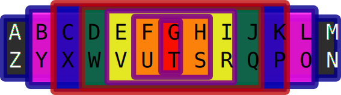

# Yggdrasil

13 13s is the basic structure of the augmented reality game Yggdrasil. There are 13 axes each with 13 elements. There are 13 teams, each of which is mapped to one element on each axis.

There are 13 tokens and 13 essential needs. The token is supposed to exchange very favorably for its associated need. Food, for instance, is really cheap in orange tokens, and shelter in brown.

The primary point of [[Yggdrasil|13-13s]] is the control of space.

All spaces within the system are alloted at each round in proportion to the prevalence of the 13 teams according to the portion of the year they occupy on the [[13-sign zodiac|13-13s.axes.months]].

## Coordinating With The Establishment

Two of the needs, Substances and Sex, put the game at potential odds with law enforcement. The other teams, of which the existing establishment is one, coordinate to help back credible retaliatory threats.

Law enforcement officers will receive gold tokens in addition to any others they might hold, so a black cop will self-identify.

